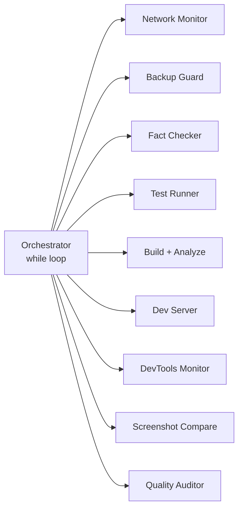
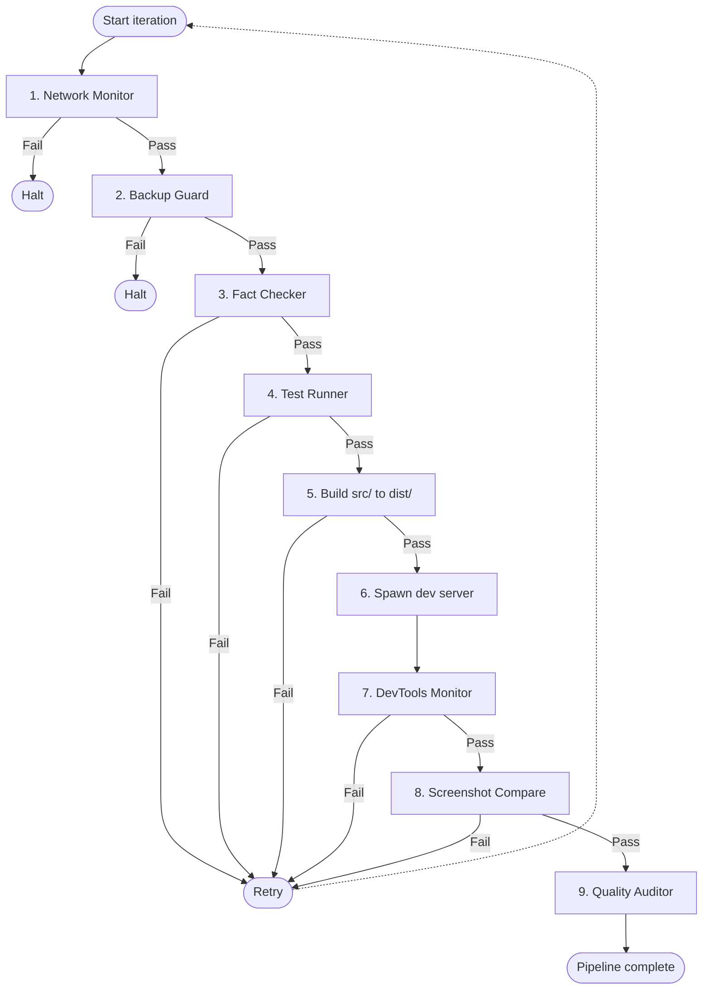

# Universal Agent Enforcer

Deterministic validation scripts for AI coding agent output — catch hallucinated imports, runtime errors, deleted files, and hardcoded secrets before they ship.

[![TypeScript][typescript-badge]][typescript-url]
[![Node.js][node-badge]][node-url]
[![License: MIT][license-badge]][license-url]
[![CI][ci-badge]][ci-url]

[typescript-badge]: https://img.shields.io/badge/TypeScript-5.4-3178C6?logo=typescript&logoColor=white
[typescript-url]: https://www.typescriptlang.org/
[node-badge]: https://img.shields.io/badge/Node.js-%E2%89%A518-339933?logo=node.js&logoColor=white
[node-url]: https://nodejs.org/
[license-badge]: https://img.shields.io/badge/License-MIT-yellow.svg
[license-url]: https://opensource.org/licenses/MIT
[ci-badge]: https://github.com/ntd25022006q/universal-agent-enforcer/actions/workflows/ci.yml/badge.svg
[ci-url]: https://github.com/ntd25022006q/universal-agent-enforcer/actions/workflows/ci.yml

---

## The Problem

AI coding agents (Cursor, Windsurf, Cline, Roo Code) generate code that compiles and passes existing tests but breaks in production due to hallucinated dependencies, missing files, leaked secrets, or runtime exceptions that only surface when a real browser loads the page.

| Failure Mode           | What Happens                                    | Why CI Misses It                            |
| :--------------------- | :---------------------------------------------- | :------------------------------------------ |
| Hallucinated imports   | Agent imports packages not in `package.json`    | Type-checkers assume imports resolve        |
| Hardcoded secrets      | Agent embeds API keys in source files           | Secret scanners are optional                |
| Deleted files          | Agent removes files during refactoring          | CI starts fresh; can't detect missing files |
| Runtime console errors | Code throws uncaught exceptions in the browser  | Unit tests don't catch DOM-level errors     |
| Layout breakage        | CSS/HTML changes render blank pages             | No visual regression baseline               |
| Infinite repair loops  | Agent repeats the same failing fix indefinitely | No loop detection                           |

**Universal Agent Enforcer** is 14 TypeScript scripts that run deterministic checks on agent output — verifying imports resolve, catching runtime console errors via CDP, auto-restoring deleted files, and comparing screenshots for layout breakage. Nothing AI-powered — just validation scripts that exit with code `1` when something is wrong.

---

## Architecture

The orchestrator runs a **sequential pipeline** — each step must pass before the next runs. If a step fails, the loop restarts up to `MAX_ORCHESTRATE_LOOPS` iterations (default: 5). This is a `while` loop with `execSync`, not a multi-agent system.



### Pipeline Flow



- **Steps 1-2** halt on failure (environmental problems)
- **Steps 3-8** retry on failure (fixable code issues)
- **Step 9** always runs (generates report regardless of outcome)
- **No parallelism** — each step blocks via `execSync`

---

## Script Reference

| #   | Script                         | What It Does                                                                                                            |
| :-- | :----------------------------- | :---------------------------------------------------------------------------------------------------------------------- |
| 1   | `scripts/orchestrator.ts`      | Sequential pipeline runner — `while` loop with `execSync`, retries on failure                                           |
| 2   | `scripts/fact-checker.ts`      | Regex-scans imports against `package.json` + `node_modules/`; detects hardcoded API keys                                |
| 3   | `scripts/devtools-monitor.ts`  | CDP console error capture; clicks up to 5 interactive elements to trigger hidden errors                                 |
| 4   | `scripts/backup-guard.ts`      | Copies protected paths to `.agent_backups/latest/`; auto-restores deleted files                                         |
| 5   | `scripts/stealth-browser.ts`   | Puppeteer with stealth plugin; connects to CloakBrowser (port 9222) or falls back to local Chromium                     |
| 6   | `scripts/visual-regression.ts` | Playwright screenshots compared byte-for-byte; flags >15% size deviation as layout breakage                             |
| 7   | `scripts/test-runner.ts`       | Runs Vitest + Playwright; tracks consecutive identical failures — halts after 3 (loop detection)                        |
| 8   | `scripts/build.ts`             | Copies `src/` to `dist/` — not a bundler, just a copy operation                                                         |
| 9   | `scripts/build-analyzer.ts`    | Checks build directory exists, minimum size threshold, and mock data patterns (`placeholder_api`, `mock_response_data`) |
| 10  | `scripts/quality-auditor.ts`   | Generates Markdown audit report in `.agent_logs/quality_audit_report.md`                                                |
| 11  | `scripts/network-monitor.ts`   | HTTP requests to Google, GitHub, npm to verify connectivity; detects proxy env vars                                     |
| 12  | `scripts/interactive-cli.ts`   | Node.js `readline` prompts — `askUser()` and `askApproval()` for human-in-the-loop                                      |
| 13  | `scripts/server.ts`            | Minimal `http.createServer` serving `src/` on port 3001                                                                 |
| 14  | `mcp-config.json`              | Pre-written MCP server configs for Cursor, Windsurf, and Claude Desktop                                                 |

### Key Scripts in Detail

**Fact Checker** — The most useful module. Scans every `.js/.ts/.jsx/.tsx` file for ESM `import` and CJS `require()` statements, then verifies each package is declared in `package.json` and exists in `node_modules/`. Also scans for hardcoded OpenAI (`sk-...`), GitHub (`ghp_...`), and Google (`AIzaSy...`) API keys.

**DevTools Monitor** — Connects to Chrome DevTools Protocol, captures console errors, page exceptions, failed requests, and HTTP 5xx. Clicks interactive elements to surface hidden runtime errors.

**Backup Guard** — Snapshots protected paths (`src/`, `package.json`, `tsconfig.json`, `.cursorrules`) and auto-restores any that were deleted.

---

## Demo Dashboard

The `src/` directory contains a dark-themed demo dashboard served by the built-in dev server. It demonstrates the type of application the enforcement pipeline validates:

- **Metric cards** — Display `—` until pipeline produces real values (no fake data)
- **Neural Weights Optimization** — Multiplies input by 1.42 and rounds to 2 decimal places (a simple calculator, not a neural network — the name is tongue-in-cheek)
- **Audit log** — Three hardcoded static entries for visual layout purposes

The dashboard exists to give the DevTools Monitor interactive elements to click and the E2E test something to assert against.

---

## Quick Start

### Prerequisites

- Node.js >= 18
- ~500 MB disk space for browser binaries (Puppeteer + Playwright)

### Install

```bash
git clone https://github.com/ntd25022006q/universal-agent-enforcer.git
cd universal-agent-enforcer
npm install
npx playwright install chromium
```

### Configure (optional)

```bash
cp .env.example .env
```

Default values work for local development. See configuration table below.

### Run the Full Pipeline

```bash
npm run agent:orchestrate
```

Override retry limit:

```bash
MAX_ORCHESTRATE_LOOPS=3 npm run agent:orchestrate
```

### Run Individual Scripts

```bash
npm run agent:fact-check       # Verify imports + scan for secrets
npm run agent:backup           # Create backup snapshot
npm run agent:restore          # Restore from latest backup
npm run agent:check-network    # Check network connectivity
npm run agent:browser          # Launch stealth browser
npm run agent:devtools         # CDP console error capture
npm run agent:visual           # Screenshot comparison
npm run agent:test-run         # Vitest + Playwright with loop detection
npm run agent:analyze-build    # Validate build output
npm run agent:audit            # Generate quality audit report
```

### Test Backup Restore

```bash
npm run agent:backup           # Create snapshot
rm -rf src/                    # Simulate destructive agent action
tsx scripts/backup-guard.ts    # Auto-detects missing src/ and restores it
```

---

## Configuration

| Variable                     | Default | Description                                             |
| :--------------------------- | :------ | :------------------------------------------------------ |
| `MAX_ORCHESTRATE_LOOPS`      | `5`     | Maximum retry iterations for the orchestrator           |
| `AGENT_LLM_PROVIDER`         | `local` | Logged for reference; does not affect pipeline behavior |
| `REMOTE_DEBUG_PORT`          | `9222`  | Port for CloakBrowser CDP connection                    |
| `MIN_BUNDLE_SIZE_KB`         | `10`    | Minimum build size threshold for Build Analyzer         |
| `DEV_SERVER_PORT`            | `3001`  | Port for the dev server                                 |
| `HTTP_PROXY` / `HTTPS_PROXY` | —       | Proxy configuration detected by Network Monitor         |

---

## Project Structure

```
universal-agent-enforcer/
├── scripts/
│   ├── orchestrator.ts          # Sequential pipeline runner (while loop + execSync)
│   ├── fact-checker.ts          # Import verification + secret scanning
│   ├── devtools-monitor.ts      # CDP console error capture + interaction simulation
│   ├── backup-guard.ts          # File protection with auto-restore
│   ├── stealth-browser.ts       # Puppeteer Stealth + CloakBrowser fallback
│   ├── visual-regression.ts     # Screenshot byte comparison + size deviation
│   ├── test-runner.ts           # Vitest/Playwright runner with loop detection
│   ├── build-analyzer.ts        # Build dir existence, size, mock pattern scan
│   ├── build.ts                 # Copy src/ → dist/
│   ├── quality-auditor.ts       # Markdown audit report generator
│   ├── network-monitor.ts       # Connectivity check (Google, GitHub, npm)
│   ├── interactive-cli.ts       # Readline prompts for human-in-the-loop
│   └── server.ts                # Dev server on localhost:3001
├── src/
│   ├── app.js                   # Dashboard logic (calculateWeights)
│   ├── index.html               # Dashboard markup
│   └── style.css                # Dashboard styling
├── tests/
│   ├── app.test.js              # Unit tests (Vitest)
│   └── app.spec.js              # E2E tests (Playwright)
├── .github/workflows/ci.yml    # GitHub Actions CI (lint, test, build)
├── .cursorrules                 # Cursor/Windsurf behavioral rules
├── .clinerules                  # Cline/Roo Code behavioral rules
├── .env.example                 # Environment variable template
├── eslint.config.js             # ESLint flat config
├── mcp-config.json              # MCP configs for Cursor/Windsurf/Claude Desktop
├── playwright.config.js         # Playwright configuration
├── tsconfig.json                # TypeScript strict configuration
└── vitest.config.js             # Vitest configuration
```

---

## License

[MIT](LICENSE) — Copyright &copy; 2026 Nguyen Tien Dat. All rights reserved.
