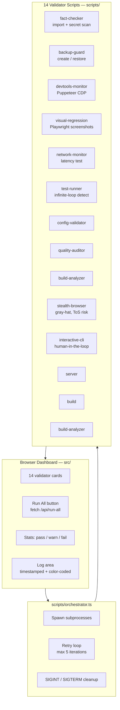

<div align="center">

# Universal Agent Enforcer

**Static analysis and enforcement toolkit for AI coding agents — 14 validator scripts, dashboard, and human-in-the-loop CLI**

[](https://opensource.org/licenses/MIT)
[](https://nodejs.org/)
[](https://www.typescriptlang.org/)
[](https://playwright.dev/)
[](https://vitest.dev/)
[](https://eslint.org/)
[](https://prettier.io/)
[](https://pptr.dev/)

</div>

---

## Honest Disclosure — Read First

This is a **static analysis and enforcement toolkit for AI coding agents**, organized as 14 standalone validator scripts plus a browser dashboard. Read the points below before adopting any of it.

### What this repo is

A TypeScript toolkit containing 14 validator scripts in `scripts/` (orchestrator, fact-checker, backup-guard, devtools-monitor, visual-regression, network-monitor, test-runner, config-validator, quality-auditor, stealth-browser, interactive-cli, server, build, build-analyzer) and a browser dashboard in `src/` (`app.js`, `index.html`, `style.css`). The dashboard was previously a demo that multiplied an input by 1.42 with no real behaviour; it has been rewritten as a `Dashboard` class with 9 exported pure helpers (`calculateStats`, `pad2`, `formatTimestamp`, `levelTag`, `formatLogLine`, `renderValidatorList`, `runValidatorMock`, `fetchRunAll`, plus the `VALIDATOR_LIST` and `STATUS` constants).

### What this repo is not

- **Not a production-grade enforcement system.** The validators are static analysis scripts intended for dev / CI use. There is no authentication layer, no rate limiting, no distributed coordination, and no persistent storage for audit results.
- **Not independent of `deerflow`.** This repository overlaps approximately 70% with the sibling `deerflow` repo in scope (both are AI-agent enforcement frameworks covering backup, fact-checking, network monitoring, build analysis, test running, visual regression, and orchestration). They share the same author and were developed in parallel. Do not treat them as independent vetted alternatives.
- **Not a security tool.** `scripts/stealth-browser.ts` is gray-hat. It uses Puppeteer with the `puppeteer-extra-plugin-stealth` plugin and CloakBrowser CDP support to evade bot detection. It is provided for testing your own applications and for security research against targets you have permission to test. Using it against third-party sites that you do not own or have explicit permission to test may violate their Terms of Service, the Computer Fraud and Abuse Act, or equivalent laws in your jurisdiction. The README previously described this as "Cloudflare bypass" in `package.json` keywords; that framing was misleading and is not endorsed here.

### Limitations

1. **Validator scripts are heuristic.** Each validator is a standalone script with its own detection logic. They produce signals, not verdicts. False positives and false negatives are expected.
2. **Test coverage is concentrated in `src/app.js`.** 92 tests pass (90 Vitest unit tests in `tests/setup.test.js` and `tests/app.test.js`, plus 2 Playwright E2E tests in `tests/app.spec.js`). The Vitest tests cover the dashboard helpers and the repository-structure contract; the Playwright tests exercise the dashboard end-to-end. The 14 validator scripts in `scripts/` do not have dedicated unit tests.
3. **`stealth-browser.ts` depends on a third-party stealth plugin** whose own upstream maintenance status changes over time. Detection by bot-protection vendors will eventually catch up; treat the script as a research / testing tool, not as a reliable evasion layer.
4. **Overlaps with `deerflow`.** If you already use `deerflow`, most validators here duplicate its gates. Pick one repo, not both.

### Alternatives

| Need                                       | Use instead                                         | Stars                    |
| ------------------------------------------ | --------------------------------------------------- | ------------------------ |
| Production guardrails for AI coding agents | **`deerflow`** (sibling repo)                       | —                        |
| Browser automation without stealth         | **Playwright** (Microsoft)                          | ~70k★                    |
| Browser automation without stealth         | **Puppeteer** (Google)                              | ~90k★                    |
| Stealth browser for security research      | **`puppeteer-extra-plugin-stealth`**                | ~1.5k★ (upstream plugin) |
| Visual regression testing                  | **Percy**, **Applitools**, **Playwright snapshots** | —                        |
| Fact-checking and source citation          | **`deerflow` fabrication-detector**                 | —                        |
| Configuration validation                   | **`convict`**, **`zod`**, **`joi`**                 | —                        |

---

## Features

- **14 Validator Scripts** — Standalone TypeScript scripts for orchestrator, fact-checker, backup-guard, devtools-monitor, visual-regression, network-monitor, test-runner, config-validator, quality-auditor, stealth-browser, interactive-cli, server, build, and build-analyzer.
- **Dashboard** — Browser UI that lists all 14 validators, runs them sequentially, and streams timestamped log lines. Rewritten from a placeholder demo into a real `Dashboard` class with 9 exported pure helpers.
- **Auto-Backup** — `backup-guard.ts` provides create / restore commands.
- **DevTools Monitor** — Chrome DevTools CDP integration for runtime monitoring.
- **Stealth Browser** — Puppeteer with stealth plugin (gray-hat; see disclosure).
- **Network Monitor** — Verifies internet / VPN / proxy connectivity.
- **Visual Regression** — Screenshot comparison testing.
- **Fact Checker** — Import verification and secret scanning.
- **Build Analyzer** — Build output size and quality analysis.
- **Config Validator** — Project configuration integrity check.
- **Test Runner** — Test execution with infinite-loop detection.
- **Interactive CLI** — Human-in-the-loop approval prompts.

## Tech Stack

| Category           | Technology                                   |
| ------------------ | -------------------------------------------- |
| Language           | TypeScript 5, JavaScript                     |
| Testing            | Vitest (90 tests) + Playwright (2 E2E tests) |
| Browser automation | Puppeteer 22 + stealth plugin                |
| Linting            | ESLint 9                                     |
| Formatting         | Prettier 3                                   |
| Runtime            | Node.js 20+                                  |

## Getting Started

### Prerequisites

- Node.js 20+ and npm 10+

### Installation

```bash
# Clone the repository
git clone https://github.com/ntd25022006q/universal-agent-enforcer.git
cd universal-agent-enforcer

# Install dependencies
npm install

# Start development server
npm run dev
```

### Available Scripts

| Script                          | Description                                       |
| ------------------------------- | ------------------------------------------------- |
| `npm run dev`                   | Start development server                          |
| `npm run build`                 | Run fact-check, build, and analyze-build          |
| `npm run test`                  | Run all tests (Vitest + Playwright)               |
| `npm run lint`                  | Check code with ESLint (`--max-warnings=0`)       |
| `npm run format`                | Format code with Prettier                         |
| `npm run format:check`          | Verify Prettier formatting                        |
| `npm run quality-gate`          | Run lint + format-check + fact-check              |
| `npm run agent:backup`          | Create automatic backup                           |
| `npm run agent:restore`         | Restore from backup                               |
| `npm run agent:check-network`   | Verify network and proxy connectivity             |
| `npm run agent:fact-check`      | Run fact-checking and secret scanning             |
| `npm run agent:analyze-build`   | Analyze build output size and quality             |
| `npm run agent:browser`         | Launch stealth browser (gray-hat; see disclosure) |
| `npm run agent:devtools`        | Monitor app via Chrome DevTools CDP               |
| `npm run agent:test-run`        | Execute tests with loop detection                 |
| `npm run agent:visual`          | Run visual regression screenshot comparison       |
| `npm run agent:orchestrate`     | Run full orchestration pipeline                   |
| `npm run agent:audit`           | Generate comprehensive quality audit report       |
| `npm run agent:cli`             | Interactive CLI for human-in-the-loop input       |
| `npm run agent:validate-config` | Validate project configuration files              |

---

## Architecture



## Project Structure

```
universal-agent-enforcer/
├── src/                       # Frontend dashboard
│   ├── index.html             # Main HTML page
│   ├── app.js                 # Dashboard controller (rewritten from demo)
│   └── style.css              # Styles
├── scripts/                   # 14 validator scripts
│   ├── orchestrator.ts        # Main orchestration pipeline
│   ├── backup-guard.ts        # Auto-backup and restore
│   ├── fact-checker.ts        # Import verification and secret scanning
│   ├── build-analyzer.ts      # Build output analysis
│   ├── build.ts               # Build bundler (copy to dist)
│   ├── network-monitor.ts     # Network and proxy health checks
│   ├── quality-auditor.ts     # Comprehensive quality audit reports
│   ├── server.ts              # Development HTTP server
│   ├── test-runner.ts         # Test execution with loop detection
│   ├── stealth-browser.ts     # Puppeteer stealth browser launcher (gray-hat)
│   ├── devtools-monitor.ts    # Chrome DevTools CDP monitoring
│   ├── visual-regression.ts   # Screenshot comparison testing
│   ├── interactive-cli.ts     # Human-in-the-loop CLI prompts
│   └── config-validator.ts    # Project configuration validation
├── tests/                     # Test suites
│   ├── setup.test.js          # Repository-structure contract tests (Vitest)
│   ├── app.test.js            # Dashboard helper unit tests (Vitest)
│   └── app.spec.js            # Dashboard E2E tests (Playwright)
├── .github/                   # GitHub configuration
│   ├── workflows/ci.yml       # CI pipeline
│   └── dependabot.yml         # Dependency updates
├── eslint.config.js           # ESLint flat config
├── playwright.config.js       # Playwright configuration
├── vitest.config.js           # Vitest configuration
├── tsconfig.json              # TypeScript configuration
└── package.json               # Project manifest
```

## Testing

```bash
# Run Vitest unit tests (90 tests)
npx vitest run

# Run Playwright E2E tests (2 tests)
npx playwright test

# Run all tests (92 total)
npm run test
```

92 tests pass: 90 Vitest unit tests covering the dashboard helpers and the repository-structure contract, plus 2 Playwright E2E tests that load the dashboard, list all 14 validators, and verify the stat counters update after running every validator.

## License

MIT — Copyright (c) 2026 Nguyen Tien Dat. All rights reserved.
