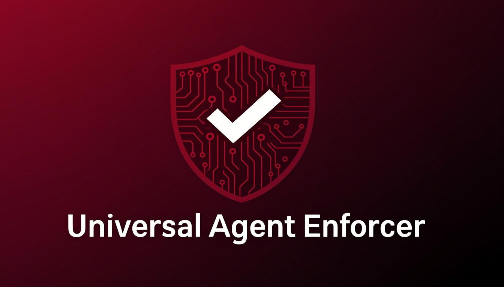
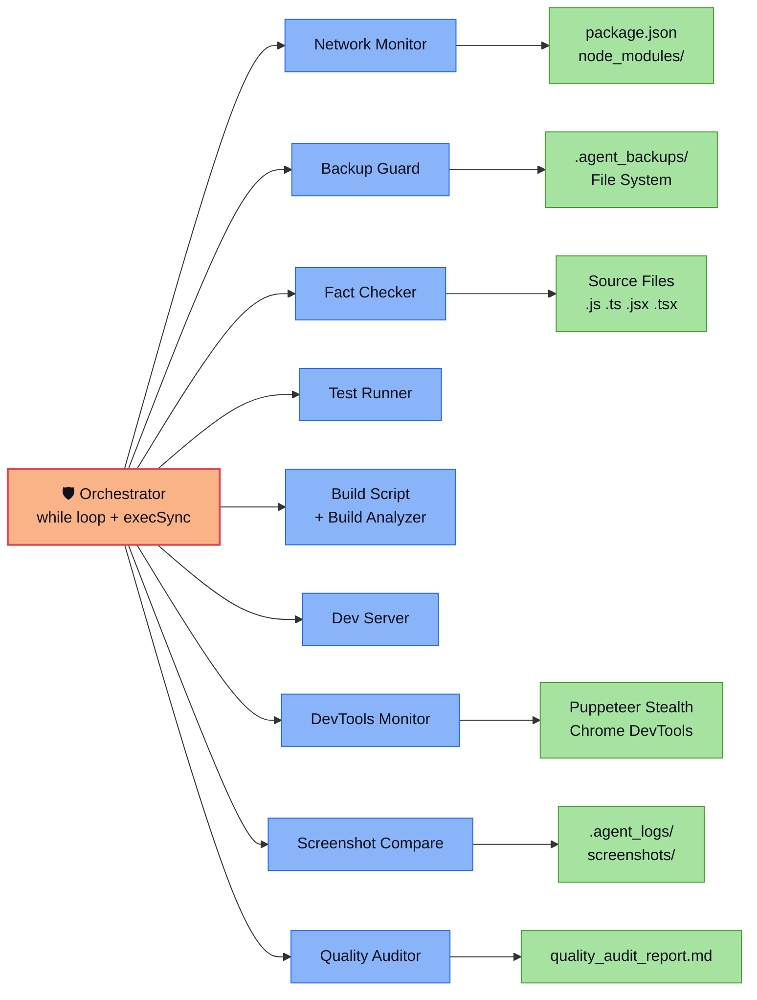
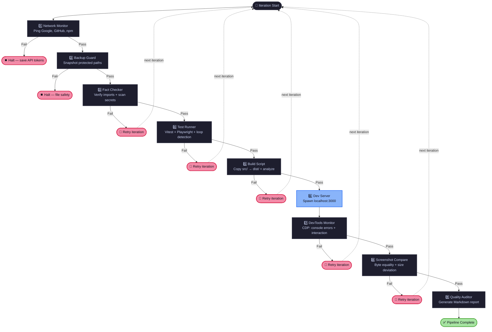
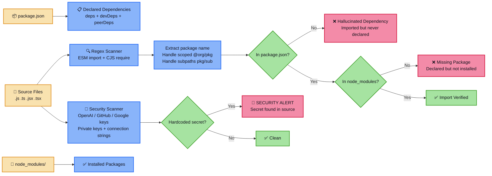
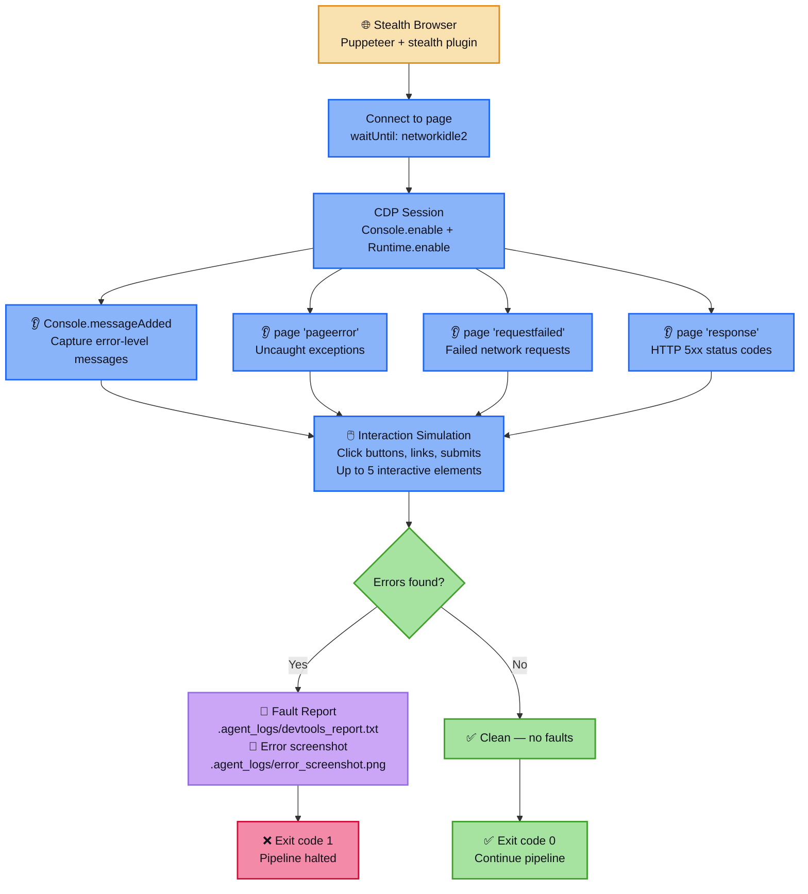

<div align="center">



# 🛡️ Universal Agent Enforcer

**Deterministic enforcement scripts for AI coding agent output validation — catch hallucinated imports, runtime errors, deleted files, and hardcoded secrets before they ship.**

[![TypeScript][typescript-badge]][typescript-url]
[![Node.js][node-badge]][node-url]
[![License: MIT][license-badge]][license-url]
[![CI][ci-badge]][ci-url]

[Modules](#14-enforcement-modules) · [Architecture](#architecture) · [Screenshots](#screenshots) · [Quick Start](#quick-start) · [Project Structure](#project-structure) · [Contributing](#contributing)

</div>

---

## The Problem

AI coding agents (Cursor, Windsurf, Cline, Roo Code) accelerate development — but they introduce a specific class of bugs that traditional CI pipelines are not designed to catch. These failures are not syntax errors or type mismatches; they are higher-level mistakes where the agent generates code that looks correct but is fundamentally disconnected from reality. A static type checker assumes that imports resolve. A test runner only validates the tests that exist. A CI pipeline starts from scratch and cannot detect that a file was deleted. The result is code that compiles and passes existing tests but breaks in production because of hallucinated dependencies, missing files, leaked secrets, or runtime exceptions that only surface when a real browser loads the page.

| Failure Mode | What Happens | Why CI Misses It |
|:---|:---|:---|
| **Hallucinated imports** | Agent imports packages that don't exist in `package.json` or `node_modules/` | Static type-checkers assume imports resolve; they don't verify installation |
| **Mock data leakage** | Agent writes `placeholder_api`, `mock_response_data` into production builds | Tests pass against mocks; no one checks the build output |
| **Hardcoded secrets** | Agent embeds API keys (`sk-...`, `ghp_...`, `AIzaSy...`) directly in source files | Secret scanners are optional; agents don't self-censor |
| **Deleted files** | Agent removes `src/`, `config/`, or `package.json` during refactoring | CI starts fresh each run; it doesn't notice missing files |
| **Runtime console errors** | Agent ships code that throws uncaught exceptions in the browser | Unit tests don't catch DOM-level errors or failed network requests |
| **Layout breakage** | Agent introduces CSS/HTML changes that render blank pages | Screenshots aren't compared; no visual regression baseline exists |
| **Infinite repair loops** | Agent repeats the same failing fix indefinitely | No loop detection — the agent keeps retrying the same broken approach |

**Universal Agent Enforcer** is a collection of 14 TypeScript scripts that run deterministic checks on agent output — verifying imports actually resolve, catching runtime console errors via CDP, auto-restoring deleted files, and comparing screenshots for layout breakage. Nothing magical, nothing AI-powered — just straightforward validation scripts that exit with code `1` when something is wrong, so your agent's pipeline stops and fixes it.

---

## Screenshots

The included demo dashboard provides a visual control panel for the enforcement pipeline. Below are real screenshots captured from a running instance of the dev server.

<table>
<tr>
<td align="center"><b>Initial Load</b></td>
<td align="center"><b>After Optimization (factor 2.5)</b></td>
</tr>
<tr>
<td></td>
<td></td>
</tr>
</table>

<div align="center">
<b>Optimized with factor 1.25 → result 1.78</b><br/>

</div>

The dashboard features a dark-themed UI with a sidebar navigation, three metric cards (Network Status, Token Consumption, Visual Checks) that are populated dynamically from pipeline output, a "Neural Weights Optimization" calculator that multiplies the input factor by 1.42 and rounds to two decimal places, and a hardcoded audit log showing recent enforcement events. The metric cards display `—` until the pipeline produces real values — this is intentional, as the dashboard is designed to visualize actual pipeline results rather than mock data.

---

## Architecture

The orchestrator runs a **sequential pipeline** — each step must pass before the next one runs. If a step fails, the loop restarts up to `MAX_ORCHESTRATE_LOOPS` iterations (default: 5). This is not a parallel multi-agent system; it's a straightforward `while` loop that executes scripts one after another via `execSync`. Every script in the pipeline is deterministic: given the same source code and environment, it produces the same result every time. There is no machine learning, no probabilistic reasoning, and no autonomous decision-making — just regex matching, file system operations, HTTP requests, and browser automation.

### Orchestrator → Scripts Pipeline



### Enforcement Pipeline Flow

The pipeline has nine steps organized into three failure categories: **halt on failure** (network and backup issues that indicate environmental problems), **retry on failure** (code quality issues the agent can fix), and **always run** (the quality auditor generates a report regardless of overall pass/fail status).



---

## 14 Enforcement Modules

| # | Module | Script | What It Checks | Honest Description |
|:--|:-------|:-------|:---------------|:-------------------|
| 1 | **Orchestrator** | `scripts/orchestrator.ts` | Runs all pipeline steps in sequence | A `while` loop that calls `execSync` on each script in order. Retries up to N iterations on failure. **Not a multi-agent system** — just sequential script execution with retry logic. |
| 2 | **Fact Checker** | `scripts/fact-checker.ts` | Import verification + secret scanning | Regex-scans ESM `import` and CJS `require()` against `package.json` + `node_modules/`. Detects hardcoded OpenAI, GitHub, and Google API keys. **The most useful module** — catches the #1 agent failure mode. |
| 3 | **DevTools Monitor** | `scripts/devtools-monitor.ts` | Runtime console errors + network failures via CDP | Connects to a page via Chrome DevTools Protocol, captures console errors, page exceptions, failed requests, and HTTP 5xx. Clicks interactive elements to trigger hidden errors. **Second most useful** — catches bugs invisible to static analysis. |
| 4 | **Backup Guard** | `scripts/backup-guard.ts` | File protection with auto-restore | Copies protected paths (`src/`, `config/`, `package.json`, `tsconfig.json`, `.cursorrules`) to `.agent_backups/latest/`. On run, checks if protected files were deleted and auto-restores them. Simple but effective. |
| 5 | **Stealth Browser** | `scripts/stealth-browser.ts` | Anti-detection browser with CloakBrowser fallback | Puppeteer with `puppeteer-extra-plugin-stealth`. Tries connecting to CloakBrowser on port 9222 first, falls back to local stealth Chromium. Works for basic bot detection bypass. |
| 6 | **Screenshot Comparison** | `scripts/visual-regression.ts` | Visual regression via byte equality + size deviation | Takes full-page Playwright screenshots, compares them byte-for-byte. If not identical, checks size deviation — flags >15% as likely layout breakage (white screen, missing components). **Not pixel-level diffing** — just byte equality and file size comparison. |
| 7 | **Test Runner** | `scripts/test-runner.ts` | Test execution with infinite loop detection | Runs `npm run test` (Vitest + Playwright). Tracks consecutive failures with the same error message — halts after 3 to prevent infinite agent repair loops. |
| 8 | **Build Analyzer** | `scripts/build-analyzer.ts` | Build output validation | Checks that a build directory exists (`dist/`, `build/`, `.next/`, `out/`, `.output/`) and its total size exceeds a configurable minimum. Scans for two mock data patterns: `placeholder_api` and `mock_response_data`. Straightforward checks, not deep AST analysis. |
| 9 | **Build Script** | `scripts/build.ts` | Copy source to dist | Copies `src/` to `dist/` with recursive file copying. **Not a production compiler/bundler** — it's a copy operation, with fact-check and build-analyze hooks in the `npm run build` command. |
| 10 | **Quality Auditor** | `scripts/quality-auditor.ts` | Audit report generation | Runs `npm audit`, reads DevTools and screenshot logs, checks dist size, and generates a Markdown report in `.agent_logs/quality_audit_report.md`. |
| 11 | **Network Monitor** | `scripts/network-monitor.ts` | Internet connectivity verification | Makes HTTP requests to Google, GitHub, and npm to verify connectivity. Checks for proxy env vars. Exits with code 1 if all connections fail. |
| 12 | **Interactive CLI** | `scripts/interactive-cli.ts` | Human-in-the-loop prompts | Node.js `readline` prompts — `askUser()` for free-text input and `askApproval()` for yes/no confirmation. Useful for human-in-the-loop workflows, but it's just terminal prompts, not a mock data enforcement gate. |
| 13 | **Dev Server** | `scripts/server.ts` | Local static file server | Minimal `http.createServer` serving `src/` on port 3001 with standard MIME types and path traversal protection. Used by DevTools Monitor and Screenshot Comparison for live verification. |
| 14 | **MCP Configuration** | `mcp-config.json` | Pre-written MCP server configs | MCP configs for Cursor, Windsurf, and Claude Desktop — connects to Chrome DevTools on port 9222 via `@chromedevtools/mcp`. |

---

## Fact-Checker Deep Dive

The Fact Checker is the most valuable module in this toolkit. It addresses the single most common AI agent failure: **importing packages that don't exist**. When an AI coding agent generates code, it frequently "invents" imports — writing `import { coolFeature } from 'some-package'` without ever adding `some-package` to `package.json` or running `npm install`. This is the number-one source of build failures in agent-generated code, and it's a problem that neither TypeScript's type checker nor ESLint can catch, because those tools assume that imports will resolve at build time. The Fact Checker closes this gap by verifying that every import in the codebase actually points to a declared, installed package.

### How It Works

The Fact Checker operates in two distinct phases: import verification and security scanning. In the import verification phase, it first reads `package.json` to build a `Set<string>` of all declared dependencies from the `dependencies`, `devDependencies`, and `peerDependencies` fields. It then recursively walks the workspace directory, reading every `.js`, `.ts`, `.jsx`, and `.tsx` file (excluding `node_modules/`, `.git/`, `scripts/`, and `.agent_backups/`). For each file, it applies two regex patterns — one for ESM imports (`import ... from 'package'`) and one for CJS requires (`require('package')`) — and extracts the package specifier from each match.

Once a package specifier is extracted, the Fact Checker applies a series of filters. Relative imports (starting with `.` or `/`) are skipped because they refer to local files, not external packages. Node.js built-in modules (like `fs`, `path`, or `node:fs`) are recognized from `module.builtinModules` and skipped. For scoped packages (like `@org/package/sub`), the checker extracts `@org/package` as the main package name. For subpath imports (like `lodash/map`), it extracts `lodash` as the main package. The remaining package names are then verified in two tiers: first, whether the package is declared in `package.json`, and second, whether the package actually exists in `node_modules/`. A package that fails the first check is reported as a "Hallucinated Dependency," while a package that passes the first check but fails the second is reported as "Missing Package" (declared but not installed).

In the security scanning phase, the Fact Checker scans every source file for hardcoded secrets using four regex patterns: OpenAI API keys (`sk-[a-zA-Z0-9_-]{40,}`), GitHub Personal Access Tokens (`gh[opr]_[a-zA-Z0-9]{36,}`), Google API keys (`AIzaSy[a-zA-Z0-9_-]{33}`), and generic private keys / connection strings. The scanner filters out template placeholders containing `your_`, `placeholder_`, `example_`, or `api_key_here` to avoid false positives on configuration templates. If any hallucinated import or hardcoded secret is found, the Fact Checker exits with code `1` to halt the pipeline.



### Supported Secret Patterns

| Pattern | Regex | Example |
|:--------|:------|:--------|
| OpenAI API Key | `sk-[a-zA-Z0-9_-]{40,}` | `sk-proj-abc123...` |
| GitHub PAT | `gh[opr]_[a-zA-Z0-9]{36,}` | `ghp_xxxxxxxxxx...` |
| Google API Key | `AIzaSy[a-zA-Z0-9_-]{33}` | `AIzaSyB-abc123...` |
| Generic Secrets | `private_key`, `client_secret`, `conn_string`, `password` | `password: "super_secret_value_12345"` |

---

## DevTools Monitor Deep Dive

The DevTools Monitor is the second most valuable module. It catches runtime errors that are invisible to static analysis and unit tests. While the Fact Checker operates on source code text and the Test Runner executes test suites, the DevTools Monitor actually loads your application in a real browser, attaches to the Chrome DevTools Protocol, and captures every error that occurs — including errors triggered by user interactions like button clicks and form submissions. This gives you ground-truth feedback on runtime behavior that no amount of static analysis can provide.

### How It Works

The DevTools Monitor begins by launching a stealth browser instance through the `getStealthBrowser()` function exported from the Stealth Browser module. This function first attempts to connect to an existing CloakBrowser instance running on port 9222 (an anti-detect browser used for Cloudflare-protected sites), and falls back to launching a local Chromium instance with `puppeteer-extra-plugin-stealth` if no CloakBrowser is available. Once the browser is ready, the monitor opens a new page, navigates to the target URL (defaulting to `http://localhost:3000`), and waits for the `networkidle2` event to ensure the page has finished loading.

After navigation, the monitor creates a Chrome DevTools Protocol (CDP) session and enables two domains: `Console.enable` (to capture browser console messages) and `Runtime.enable` (to capture runtime exceptions). It then attaches four event listeners: `Console.messageAdded` captures error-level console messages with their source, text, URL, and line number; `pageerror` captures uncaught JavaScript exceptions; `requestfailed` captures network requests that failed due to DNS errors, connection refused, or other transport-level failures; and `response` captures HTTP 5xx server error responses.

The most distinctive feature of the DevTools Monitor is its interaction simulation. After loading the page and attaching the error listeners, the monitor queries all interactive elements on the page (`button`, `a`, `input[type="submit"]`, and `[role="button"]`) and clicks up to 5 of them with 500ms delays between each click. This is crucial because many runtime errors only appear after user interaction — a button click might trigger an AJAX request that fails, an event handler might reference an undefined variable, or a form submission might cause a page exception. By clicking around, the monitor surfaces these errors that would otherwise go undetected until a real user encounters them.



---

## Dashboard

The project includes a demo dashboard (`src/`) served by the built-in dev server. The dashboard is a dark-themed control panel built with vanilla HTML, CSS, and JavaScript — no frameworks, no build step required. It demonstrates the type of application that the enforcement pipeline is designed to validate: a simple page with interactive elements that the DevTools Monitor can click, a form input that produces a calculable result, and a visual layout that the Screenshot Comparison module can baseline and compare.

### Dashboard Features

The dashboard consists of three main areas. The **sidebar** contains navigation links (Overview, Settings, MCP Tools, Performance) and a user profile section — these are interactive elements that the DevTools Monitor clicks during its interaction simulation phase. The **metrics grid** displays three cards (Network Status, Token Consumption, Visual Checks) that are populated dynamically from pipeline results — when no pipeline has run, they display `—` as a placeholder, which is intentional: the dashboard does not generate fake metrics. The **content grid** contains two cards: the "Neural Weights Optimization" calculator and the "Enforcer Audit Log."

The **Neural Weights Optimization** calculator is the dashboard's interactive feature. It takes a numeric "Weight Factor" input (default: 1.25), multiplies it by 1.42, rounds to two decimal places, and displays the result. This is a simple multiplication operation, not a neural network — the name is a tongue-in-cheek reference to the "AI agent" branding that surrounds the tooling ecosystem. The calculator exists to give the DevTools Monitor something to click and the E2E test something to assert against. The Vitest unit test verifies that `calculateWeights(1.25) === 1.78`, and the Playwright E2E test fills the input, clicks the button, and asserts the result text matches `1.78`.

The **Enforcer Audit Log** displays three hardcoded log entries showing recent enforcement events (visual regression baseline, fact-check pass, stealth browser connection). These entries are static HTML — they are not generated from actual pipeline output. In a production deployment, this log would be populated from the `.agent_logs/` directory.

---

## Features

The following features are implemented and verified in the codebase. Every feature listed here corresponds to actual, working code — not aspirational descriptions or planned functionality.

| Feature | How It Works | Script |
|:--------|:-------------|:-------|
| **Import hallucination detection** | Regex-scans ESM `import` and CJS `require()` against `package.json` + `node_modules/` | `fact-checker.ts` |
| **Hardcoded secret scanning** | Detects OpenAI, GitHub, Google API keys and generic private keys in source files | `fact-checker.ts` |
| **Runtime error capture via CDP** | Connects to Chrome DevTools Protocol to capture console errors, page exceptions, failed requests, HTTP 5xx | `devtools-monitor.ts` |
| **Interaction simulation** | Clicks up to 5 interactive elements (buttons, links, submits) to trigger hidden runtime errors | `devtools-monitor.ts` |
| **Auto-backup and restore** | Copies protected paths to `.agent_backups/latest/` and auto-restores deleted files on next run | `backup-guard.ts` |
| **Screenshot comparison** | Takes Playwright screenshots, compares byte-for-byte, flags >15% size deviation as layout breakage | `visual-regression.ts` |
| **Infinite loop detection** | Tracks consecutive test failures with the same error message; halts after 3 identical failures | `test-runner.ts` |
| **Build output validation** | Checks build directory existence, minimum size threshold, and mock data patterns in build output | `build-analyzer.ts` |
| **Network connectivity check** | Verifies connectivity to Google, GitHub, and npm; detects proxy configuration | `network-monitor.ts` |
| **Sequential pipeline orchestration** | `while` loop with `execSync` — runs all steps in order with configurable retry limit | `orchestrator.ts` |
| **Quality audit report** | Generates Markdown report with security, dependency, test, browser, and visual check summaries | `quality-auditor.ts` |
| **Stealth browser with fallback** | Connects to CloakBrowser (port 9222) for anti-detect, falls back to local stealth Chromium | `stealth-browser.ts` |
| **MCP configuration** | Pre-written MCP server configs for Cursor, Windsurf, and Claude Desktop | `mcp-config.json` |
| **Human-in-the-loop prompts** | `readline`-based CLI for user input and approval prompts | `interactive-cli.ts` |
| **TypeScript strict mode** | All scripts are `.ts` with `strict: true`, `noImplicitAny`, `strictNullChecks` | `tsconfig.json` |
| **CI/CD pipeline** | GitHub Actions workflow with lint, test, and build jobs | `.github/workflows/ci.yml` |

---

## Quick Start

### Prerequisites

- **Node.js** ≥ 18 (ES modules are used throughout)
- **Git** (for cloning the repository)
- Approximately 500 MB of disk space for browser binaries (Puppeteer + Playwright)

### 1. Install

```bash
git clone https://github.com/ntd25022006q/universal-agent-enforcer.git
cd universal-agent-enforcer
npm install
```

### 2. Install Browser Binaries

Required for Playwright E2E tests and Puppeteer stealth browser automation. Both browser engines are needed because the project uses Playwright for screenshot comparison and E2E tests, and Puppeteer for CDP-based DevTools monitoring and stealth browsing.

```bash
npx playwright install chromium
```

Puppeteer's bundled Chromium is installed automatically during `npm install` via the `puppeteer` package's postinstall script.

### 3. Configure Environment (Optional)

```bash
cp .env.example .env
```

The default values work for local development without any changes. See the [Configuration](#configuration) table below for available options.

### 4. Run the Full Pipeline

```bash
npm run agent:orchestrate
```

This runs all 9 pipeline steps sequentially. If any step exits with code 1, the loop restarts (up to 5 iterations by default). Override with:

```bash
MAX_ORCHESTRATE_LOOPS=3 npm run agent:orchestrate
```

### 5. Run Individual Modules

Each module can be run independently via npm scripts. This is useful during development when you want to check a specific aspect without running the full pipeline.

```bash
# Verify imports and detect hardcoded secrets
npm run agent:fact-check

# Create a backup snapshot of protected files
npm run agent:backup

# Restore from the latest backup
npm run agent:restore

# Check network connectivity
npm run agent:check-network

# Launch stealth browser (tests against bot.sannysoft.com)
npm run agent:browser

# Run DevTools monitor against localhost:3000
npm run agent:devtools

# Run screenshot comparison
npm run agent:visual

# Run Vitest + Playwright with loop detection
npm run agent:test-run

# Analyze build output
npm run agent:analyze-build

# Generate quality audit report
npm run agent:audit
```

### 6. Test the Backup Restore

The Backup Guard's auto-restore feature can be tested manually by creating a backup, deleting a protected file, and running the guard again:

```bash
npm run agent:backup      # Create snapshot
rm -rf src/               # Simulate destructive agent action
tsx scripts/backup-guard.ts  # Auto-detects missing src/ and restores it
```

### 7. Connect CloakBrowser (Optional)

For Cloudflare-protected sites, start an anti-detect browser with remote debugging enabled. The Stealth Browser module and DevTools Monitor will automatically detect and connect to it on port 9222.

```bash
cloak-browser --remote-debugging-port=9222
```

Then copy the MCP settings from `mcp-config.json` for your editor.

### Configuration

| Environment Variable | Default | Description |
|:---------------------|:--------|:------------|
| `MAX_ORCHESTRATE_LOOPS` | `5` | Maximum retry iterations for the orchestrator pipeline |
| `AGENT_LLM_PROVIDER` | `local` | Logged for reference; does not affect pipeline behavior |
| `REMOTE_DEBUG_PORT` | `9222` | Port for CloakBrowser CDP connection |
| `MIN_BUNDLE_SIZE_KB` | `10` | Minimum build size threshold for Build Analyzer |
| `DEV_SERVER_PORT` | `3001` | Port for the dev server used by DevTools Monitor and E2E tests |
| `HTTP_PROXY` / `HTTPS_PROXY` | — | Proxy configuration detected by Network Monitor |

---

## Project Structure

```
universal-agent-enforcer/
├── scripts/
│   ├── orchestrator.ts          # Sequential pipeline runner (while loop + execSync)
│   ├── fact-checker.ts          # Import verification + secret scanning (regex)
│   ├── devtools-monitor.ts      # CDP console error capture + interaction simulation
│   ├── backup-guard.ts          # File protection with auto-restore
│   ├── stealth-browser.ts       # Puppeteer Stealth + CloakBrowser fallback
│   ├── visual-regression.ts     # Screenshot byte comparison + size deviation
│   ├── test-runner.ts           # Vitest/Playwright runner with loop detection
│   ├── build-analyzer.ts        # Build dir existence, size, mock pattern scan
│   ├── build.ts                 # Copy src/ → dist/
│   ├── quality-auditor.ts       # Markdown audit report generator
│   ├── network-monitor.ts       # Connectivity check (Google, GitHub, npm)
│   ├── interactive-cli.ts       # Readline prompts for human-in-the-loop
│   └── server.ts                # Dev server on localhost:3001
│
├── src/
│   ├── app.js                   # Application entry point (dashboard logic)
│   ├── index.html               # HTML template (dashboard markup)
│   └── style.css                # Stylesheet (dashboard styling)
│
├── tests/
│   ├── app.test.js              # Unit tests (Vitest) — calculateWeights function
│   └── app.spec.js              # E2E tests (Playwright) — dashboard interaction
│
├── docs/
│   ├── banner.png               # Social preview banner image
│   └── screenshots/             # Dashboard screenshots for README
│
├── .github/
│   └── workflows/
│       └── ci.yml               # GitHub Actions CI (lint, test, build)
│
├── .cursorrules                 # Cursor/Windsurf behavioral rules
├── .clinerules                  # Cline/Roo Code behavioral rules
├── .env.example                 # Environment variable template
├── .prettierrc                  # Prettier config
├── eslint.config.js             # ESLint flat config
├── LICENSE                      # MIT License
├── mcp-config.json              # MCP configs for Cursor/Windsurf/Claude Desktop
├── package.json                 # Dependencies and scripts
├── playwright.config.js         # Playwright configuration
├── tsconfig.json                # TypeScript strict configuration
└── vitest.config.js             # Vitest configuration
```

---

## Orchestrator Pipeline

The orchestrator is intentionally simple: it's a `while` loop, not a multi-agent system. It does not use any AI, machine learning, or probabilistic decision-making. It runs scripts sequentially via `execSync`, checks each exit code, and decides whether to halt, retry, or continue based on deterministic rules.

### Step-by-Step Execution

```
loopCount = 0
while loopCount < MAX_ORCHESTRATE_LOOPS:
    loopCount++
    Run Step 1: Network Check        → If fail: HALT (don't waste API tokens)
    Run Step 2: Backup Guard         → If fail: HALT (file safety risk)
    Run Step 3: Fact Checker         → If fail: CONTINUE (retry iteration)
    Run Step 4: Test Runner          → If fail: CONTINUE (retry iteration)
    Run Step 5: Build Script         → If fail: CONTINUE (retry iteration)
    Spawn Step 6: Dev Server (background)
    Run Step 7: DevTools Monitor     → If fail: CONTINUE (retry iteration)
    Run Step 8: Screenshot Compare   → If fail: CONTINUE (retry iteration)
    Kill Step 6: Dev Server
    If all passed: break loop
Run Step 9: Quality Auditor (always, regardless of pass/fail)
```

### Key Behaviors

- **Steps 1–2 halt on failure** — Network failure and backup failure are non-retryable; they indicate environmental problems that won't be fixed by restarting the loop.
- **Steps 3–8 retry on failure** — These are code quality issues the agent can fix between iterations. The loop restarts from Step 1 on each retry.
- **Dev Server is spawned and killed per iteration** — The server is not a persistent process; it starts before the DevTools Monitor and shuts down afterward.
- **Quality Auditor always runs** — Generates a report even on failure, so you can see what went wrong even if the pipeline never passes.
- **No parallelism** — Each step runs via `execSync`, blocking until complete. This ensures deterministic, reproducible execution.
- **Clean shutdown** — The orchestrator registers handlers for `exit`, `SIGINT`, `SIGTERM`, and `uncaughtException` to ensure the dev server process is always terminated.

---

## Behavioral Protocols

The repository includes `.cursorrules` and `.clinerules` files that are automatically loaded by Cursor/Windsurf and Cline/Roo Code respectively. These are **text instructions** — they tell the agent to follow certain conventions, but they are not programmatically enforced at runtime. The actual enforcement comes from the pipeline scripts that fail the build when violations are detected.

### What the Rules Encourage

| Rule | How It's Enforced |
|:-----|:------------------|
| **No mock data** | Build Analyzer scans for `placeholder_api` and `mock_response_data` patterns |
| **No unauthorized deletions** | Backup Guard snapshots protected paths and auto-restores missing files |
| **Structured review protocol** | Proposal → Critique → Optimization before writing code (text-only rule) |
| **TypeScript strict mode** | `tsconfig.json` enforces `strict: true`, `noImplicitAny`, `strictNullChecks` |
| **No hardcoded secrets** | Fact Checker regex-scans for API keys and private keys |
| **Import verification** | Fact Checker validates all imports against `package.json` + `node_modules/` |
| **Full pipeline pass** | `npm run agent:orchestrate` must pass before declaring a task complete |
| **Test coverage** | Test Runner requires Vitest unit tests + Playwright E2E tests to pass |

### Protected Paths

The Backup Guard protects these paths by default:

| Path | Purpose |
|:-----|:--------|
| `src/` | Application source code |
| `config/` | Configuration files |
| `package.json` | Dependency declarations |
| `tsconfig.json` | TypeScript configuration |
| `.cursorrules` | Cursor behavioral rules |

---

## MCP Configuration

The `mcp-config.json` file provides pre-written MCP (Model Context Protocol) server configurations for connecting to Chrome DevTools from your AI editor. This allows the AI agent to inspect live pages, read console output, and interact with the DOM during development.

### Cursor

```json
{
  "name": "chrome-devtools-mcp",
  "type": "command",
  "command": "npx -y @chromedevtools/mcp --remote-debugging-port=9222"
}
```

Settings → Features → MCP → Add the `cursor_mcp_config` entry.

### Windsurf

```json
{
  "mcpServers": {
    "chrome-devtools": {
      "command": "npx",
      "args": ["-y", "@chromedevtools/mcp", "--remote-debugging-port=9222"]
    }
  }
}
```

Use the `windsurf_mcp_config` entry in your Windsurf MCP settings.

### Claude Desktop

```json
{
  "mcpServers": {
    "chrome-devtools": {
      "command": "npx",
      "args": ["-y", "@chromedevtools/mcp", "--remote-debugging-port=9222"]
    }
  }
}
```

Add the `claude_desktop_config` entry to your Claude Desktop configuration file.

---

## Tech Stack

| Category | Technology |
|:---------|:-----------|
| Language | TypeScript 5.4 (strict mode, all scripts are `.ts`) |
| Runtime | Node.js ≥ 18 (ES modules) |
| Browser Automation | Puppeteer + `puppeteer-extra-plugin-stealth`, Playwright |
| Testing | Vitest (unit), Playwright (E2E) |
| Linting | ESLint 9 (flat config), Prettier |
| Runner | `tsx` for executing TypeScript directly |
| Protocol | Chrome DevTools Protocol (CDP) via `@chromedevtools/mcp` |

---

## Contributing

Contributions are welcome. The same quality gates apply to human PRs as to AI agents — every pull request must pass the full enforcement pipeline before it can be merged. This ensures that the codebase maintains the same standards that the tool itself enforces.

1. Fork the repository
2. Create a feature branch (`git checkout -b feature/my-feature`)
3. Run `npm run agent:orchestrate` locally — all steps must pass
4. Follow the existing module pattern: export functions, handle errors, exit with meaningful codes
5. Add test coverage in `tests/` (Vitest for unit tests, Playwright for E2E tests)
6. Update documentation for any public API changes
7. Ensure `npm run quality-gate` passes (lint + format + fact-check)
8. Submit your pull request

### Adding a New Enforcement Module

To add a new module to the enforcement pipeline, follow these steps:

1. Create a new script in `scripts/` following the existing TypeScript pattern
2. Export a main function and call it at the bottom of the file
3. Exit with code `0` on success and code `1` on failure
4. Add a new npm script in `package.json` (e.g., `agent:my-module`)
5. Add the step to `orchestrator.ts` in the correct position
6. Add unit tests in `tests/`
7. Update this README with the new module's entry in the table

---

## License

[MIT](LICENSE) © ntd25022006q

[typescript-badge]: https://img.shields.io/badge/TypeScript-5.4-3178C6?style=for-the-badge&logo=typescript&logoColor=white
[typescript-url]: https://www.typescriptlang.org/
[node-badge]: https://img.shields.io/badge/Node.js-%3E%3D18-339933?style=for-the-badge&logo=node.js&logoColor=white
[node-url]: https://nodejs.org/
[license-badge]: https://img.shields.io/badge/License-MIT-yellow?style=for-the-badge
[license-url]: https://opensource.org/licenses/MIT
[ci-badge]: https://img.shields.io/github/actions/workflow/status/ntd25022006q/universal-agent-enforcer/ci.yml?style=for-the-badge&label=CI
[ci-url]: https://github.com/ntd25022006q/universal-agent-enforcer/actions
